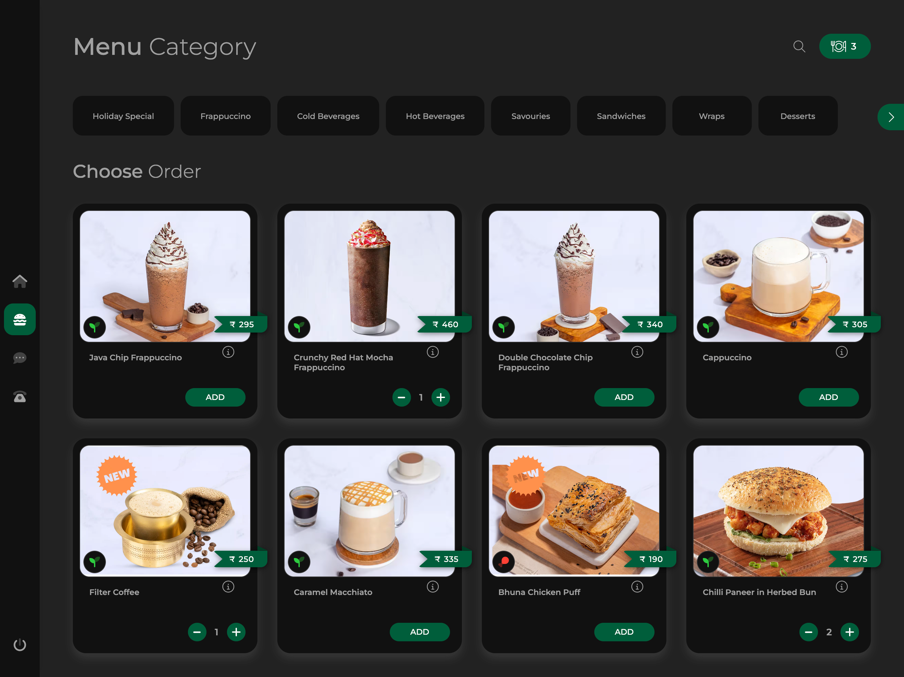

# OrderWorder

A multi-tenant restaurant SaaS platform for contactless dining powered by AI. Customers scan QR codes, browse menus, chat with the AI assistant "Jarvis", order by tap or voice, and pay directly — all from their phone, no app install required.

## Screenshots

| Menu & Cart | Dashboard | QR Code |
|---|---|---|
|  |  |  |

## Features

- **QR Code Ordering** — Per-table QR codes with deep-linking. Sub-2s load on 2G, offline-first PWA.
- **AI Assistant "Jarvis"** — Multi-provider AI (Groq → Cerebras → Gemini → SiliconFlow) with auto-failover and per-tenant keys. Recommends dishes, answers questions, takes orders.
- **Voice Ordering** — Groq Whisper STT (Hindi/Hinglish) → structured cart → ElevenLabs TTS confirmation, with browser SpeechSynthesis fallback.
- **Real-time Order Management** — Dashboard via Server-Sent Events + MongoDB Change Streams (SWR fallback), three state buckets (pending approval / active / history).
- **Kitchen Display System** — Station routing (tandoor / south-indian / main / dessert / beverage), live countdown timers, Start/Ready/Served actions.
- **Payments** — Razorpay Route (direct-to-owner settlement), Stripe (international), UPI Autodebit, cash/pay-at-table. 0.5% platform fee. Split payments + refunds supported.
- **Loyalty & Rewards** — Points engine (1 pt / ₹10), Silver/Gold/Platinum tiers with multipliers, atomic per-order awarding.
- **Customer AI Memory** — Unified profile: language, spice tolerance, favorites, allergens, birthdays.
- **WhatsApp Marketing** — Cloud API v22.0 with OpenWA + no-op fallbacks: receipts, ready notifications, campaigns, abandoned-cart recovery.
- **Owner Analytics** — Live dashboard (Recharts): revenue, top dishes, peak hours, repeat rate, GST collected, AI-generated insights. Range filters: today / 7d / 30d / 90d.
- **Multi-tenant + Roles** — Per-restaurant subdomain & HSL theming; roles: admin, kitchen, customer (full RBAC across outlets is on the roadmap).
- **Offline-First PWA** — Service worker caches static assets, falls back offline.
- **Unified Order Aggregator** — Zomato / Swiggy / manual orders in the same KDS.
- **GST / Tax Management** — Per-item tax, tax-inclusive pricing, tax summary in cart.
- **Coupons & Invoices** — Coupon validate/redeem; PDF invoices via `@react-pdf/renderer` with sequential numbering.
- **Multi-currency** — `formatCurrency` utility (INR / USD / EUR / GBP / AED); profile-driven currency now wired through the customer menu/cart/track pages, the KDS price column, dashboard chart axis formatters, and WhatsApp message templates. The only remaining hard-coded `₹` are the INR default in `currency.ts` itself and the India-first `PricingSection` plan cards (₹999 / ₹2,999) — intentional for the India launch.
- **Security** — Zod validation, bcrypt, OTP/table-PIN auth, CSRF provider, Sentry `captureError` wired, Upstash rate limit with in-memory fallback.
- **3D Food Viewer** — React Three Fiber + Drei + Google `<model-viewer>`, dynamic-imported with a WebGL capability fallback.

## Tech Stack

| Layer | Technology |
|---|---|
| Framework | Next.js 16 (Turbopack), React 19 |
| Language | TypeScript |
| Styling | Tailwind CSS 4, shadcn/ui, Motion |
| Database | MongoDB Atlas + Mongoose 9 |
| Real-time | Server-Sent Events + MongoDB Change Streams |
| Cache / Queue | Upstash Redis (with in-memory fallback) |
| Charts | Recharts |
| Auth | NextAuth.js (credentials — 3 flows) |
| Payments | Razorpay Route + Stripe + UPI Autodebit |
| AI (text) | Groq / Cerebras / Gemini / SiliconFlow (auto-failover, per-tenant keys) |
| AI (voice STT) | Groq Whisper Large v3 (Hindi/Hinglish) |
| AI (voice TTS) | ElevenLabs Multilingual v2 (+ browser SpeechSynthesis) |
| 3D / rich media | Three.js, React Three Fiber, Drei, Google `<model-viewer>` |
| WhatsApp | WhatsApp Cloud API v22.0 + OpenWA + no-op |
| Phone IVR | Twilio + Bolo.ai (Hindi) |
| Object Storage | Cloudflare R2 |
| Error Monitoring | Sentry (client, server, edge); GlitchTip optional |
| CI/CD | GitHub Actions + Vercel |
| Tests | Jest (unit) |
| Linting | Biome |
| Secrets | Doppler (optional) / `.env` |

## Quick Start

```bash
pnpm install
cp .env.example .env.local   # Configure MongoDB URI & other keys
pnpm dev                     # → http://localhost:3050
```

### Seed Demo Data

```bash
curl -X POST http://localhost:3050/api/refreshDemoData
```

Demo logins:

| Restaurant | Slug | Admin email | Password |
|---|---|---|---|
| The Spice Route | `spiceroute` | `admin@spiceroute.com` | `spiceroute@demo123` |
| Empire Restaurant | `empire` | `admin@empire.com` | `empire@123` |
| Brewpoint | `brewpoint` | `admin@brewpoint.com` | `brewpoint@123` |
| Demo | `demo` | — | `Demo@12345` |

Customer access: `http://localhost:3050/<slug>?table=T1` (phone login only).

### Docker

```bash
docker compose up
# → http://localhost:3050
```

## Project Structure

```
src/
├── app/                          # Next.js App Router
│   ├── [restaurant]/             # Dynamic restaurant pages (menu, cart, track)
│   ├── api/                      # 20 API endpoint groups
│   │   ├── admin/  auth/  chat/  coupon/  customer/  cron/
│   │   ├── feedback/  invoice/  kitchen/  loyalty/  menu/
│   │   ├── order/  payment/  refreshDemoData/  voice/
│   │   ├── webhooks/  whatsapp/  aggregator/  baseProfile/  health/
│   ├── dashboard/                # Owner dashboard (Overview, Analytics, ...)
│   ├── kitchen/                  # Kitchen Display System
│   └── scan/  setup/  signup/  logout/
├── components/
│   ├── ui/                       # shadcn/ui primitives
│   ├── chatbot/                  # AI chat interface
│   ├── features/                 # FoodViewer3D, MenuCard, ...
│   ├── layout/  base/  context/  sections/  seo/
├── hooks/  lib/  types/
└── utils/
    ├── ai/                       # Provider switcher, per-tenant config, prompts
    ├── database/                 # Mongoose models (16) & helpers
    ├── payment/                  # Razorpay / Stripe
    ├── voice/                    # STT / TTS
    ├── whatsapp/                # Cloud API + OpenWA + no-op
    └── helper/                   # currency, otp, rbac, sentryWrapper, ...
```

## Deployment

See [DEPLOYMENT.md](./DEPLOYMENT.md) for Vercel, Docker, and Render guides. See [DEPLOYMENT_ANALYSIS.md](./DEPLOYMENT_ANALYSIS.md) for the zero-cost free-tier path. See [AUDIT_REPORT.md](./AUDIT_REPORT.md) and [docs/FIX-LOG.md](./docs/FIX-LOG.md) for the feature audit and outstanding items.

## Status & honest review

See [`../about.md`](../about.md) for the business About and a critic review of what is production-ready, what is partial, and what is not yet built.

## License

MIT — see [LICENSE](./LICENSE).